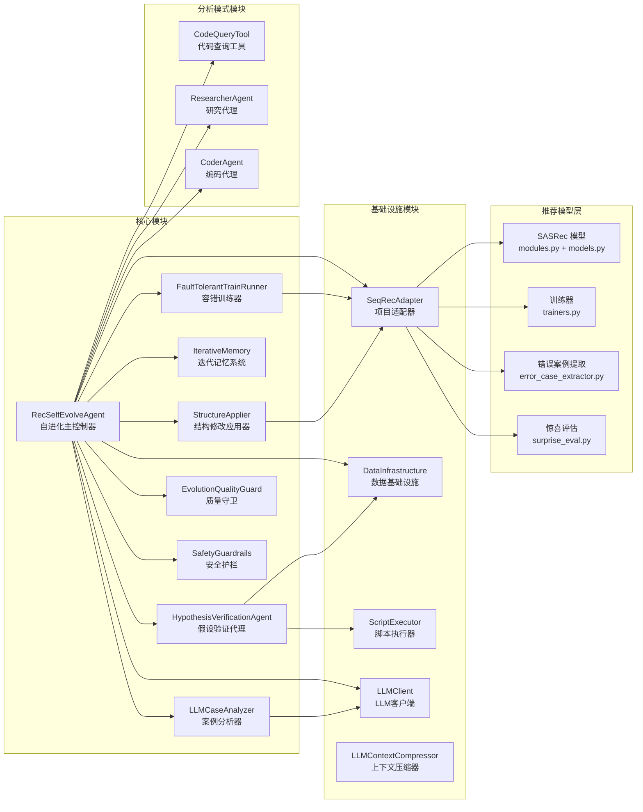
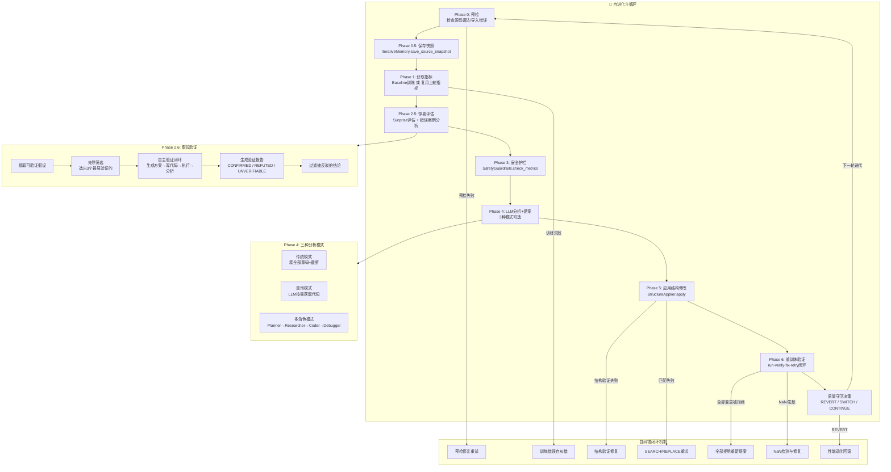
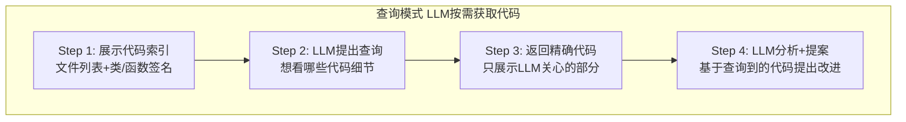
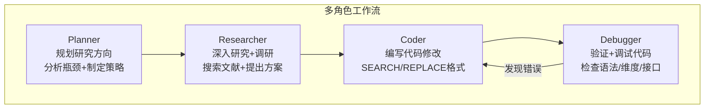
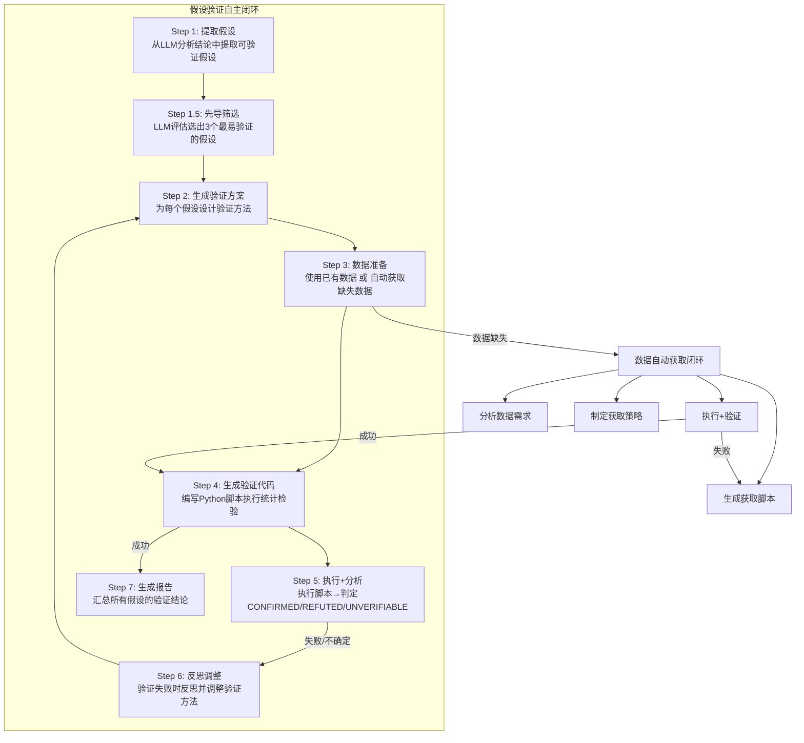

# Rec_SelEnhance — 推荐系统自增强 Agent 功能流程简介

> **Self-Evolving Recommendation System with Selective Enhancement**
> 版本: v0.8.0 | 基于两篇顶会论文方法论实现

---

## 一、系统定位

Rec_SelEnhance 是一个 **LLM驱动的推荐系统自进化Agent**，它能够：

- 🔍 **自动发现模型弱点** — 通过训练指标、惊喜评估、错误案例分析定位瓶颈
- 💡 **智能生成改进方案** — LLM基于实验证据提出参数调整+代码结构修改
- 🏗️ **自动执行代码修改** — 将SEARCH/REPLACE格式提案应用到源码并验证
- 🛡️ **闭环自纠错保障** — 多层自纠错机制确保每次修改的有效性
- 🔄 **持续迭代进化** — 每轮结果反馈到下一轮，形成自我改进循环

**核心创新**：不仅是调参数，而是让LLM直接修改模型代码结构（如注意力机制、损失函数等），并通过假设验证确保分析结论有数据支撑。

---

## 二、系统架构总览

系统由三大层级组成：

| 层级 | 组成 | 职责 |
|------|------|------|
| **Agent 控制层** | `RecSelfEvolveAgent` (core.py) | 主循环编排、阶段调度、决策协调 |
| **功能模块层** | 15+独立模块 | 训练、修改、验证、记忆、分析等 |
| **推荐模型层** | SASRec + Recmodel/ | 序列推荐模型、错误提取、惊喜评估 |

### 核心模块一览



| 模块 | 文件 | 核心功能 |
|------|------|----------|
| `RecSelfEvolveAgent` | core.py | 自进化主控制器，编排7阶段循环 |
| `FaultTolerantTrainRunner` | train_runner.py | 容错训练器，NaN检测+OOM降级 |
| `StructureApplier` | structure_applier.py | 代码修改应用器，SEARCH/REPLACE执行 |
| `IterativeMemory` | iterative_memory.py | 迭代记忆系统，快照/回滚/历史感知 |
| `HypothesisVerificationAgent` | hypothesis_verification_agent.py | 假设验证代理，自主闭环验证LLM结论 |
| `LLMCaseAnalyzer` | llm_analyzer.py | 案例分析器，惊喜评估+错误案例推理 |
| `EvolutionQualityGuard` | quality_guard.py | 质量守卫，退化检测+策略切换 |
| `SafetyGuardrails` | quality_guard.py | 安全护栏，指标底线检查 |
| `CodeQueryTool` | code_query_tool.py | 代码查询工具，LLM按需获取代码 |
| `ResearcherAgent` | researcher.py | 研究代理，文献搜索+方案调研 |
| `CoderAgent` | coder.py | 编码代理，代码编写+调试 |
| `DataInfrastructure` | data_infrastructure.py | 数据基础设施，自动发现+获取+验证 |
| `SeqRecAdapter` | project_adapter.py | 项目适配器，桥接Agent与SASRec模型 |

---

## 三、自进化主循环流程

每轮迭代经历 **7个核心阶段**，形成闭环：



### Phase 0 — 预检（Preflight Check）

> 🎯 **目的**：在训练前检查源码是否有语法/导入错误

- 调用 `FaultTolerantTrainRunner.preflight_check()` 检查所有源码文件
- 发现问题 → 触发 **预检修复自纠错**（`_preflight_fix_and_retry`）
- 修复失败 → 跳过本轮，累计连续失败次数
- 连续失败≥3次 → 自动回滚所有源码修改

### Phase 0.5 — 保存快照

> 🎯 **目的**：保存当前轮次的源码完整快照，用于后续回滚

- `IterativeMemory.save_source_snapshot()` 复制所有源码文件到快照目录
- 快照保留原始代码状态，确保任何修改都可安全回退

### Phase 1 — 获取当前指标

> 🎯 **目的**：获取当前模型的性能指标作为改进基准

- **第一轮**：执行 baseline 训练，获取初始指标
- **第二轮+**：直接复用上一轮 retrain 的指标（关键优化，避免重复训练）
- 训练使用 **run-verify-fix-retry 闭环**，失败时自动进入自纠错

### Phase 2.5 — 惊喜评估 + 错误案例分析

> 🎯 **目的**：深入分析模型在"惊喜交互"上的表现和错误模式

**惊喜评估**（`surprise_eval.py`）：
- 将测试集分为"惊喜子集"（用户行为偏离历史模式的交互）和"常规子集"
- 对比两个子集的 NDCG/Recall 差距，量化模型对惊喜的捕获能力

**错误案例提取**（`error_case_extractor.py`）：
- 从推理结果中提取500个错误预测案例
- 将物品ID转换为文本描述（标题、类别、描述）

**LLM案例分析**（`LLMCaseAnalyzer`）：
- LLM分析错误案例的共同特征
- 推理模型瓶颈（注意力机制失效、嵌入聚类、位置编码问题等）
- 提出**结构修改方案**（不仅是调参数）

### Phase 2.6 — 假设验证

> 🎯 **目的**：验证LLM分析结论是否有数据支撑，过滤"幻觉"

这是系统的**关键创新**——防止LLM产生无数据支撑的结论：

```
LLM分析结论 → 提取假设 → 筛选最易验证的 → 生成验证方案
                                    ↓
                            数据准备（已有或自动获取）
                                    ↓
                            生成验证代码（Python统计脚本）
                                    ↓
                            执行+分析结果
                                    ↓
                    ┌─── CONFIRMED ──→ 保留结论
                    ├─── REFUTED ───→ 过滤结论
                    └─── UNVERIFIABLE → 标记不确定
```

**数据自动获取闭环**（当验证需要缺失数据时）：

```
检测数据缺失 → 分析需求 → 制定获取策略 → 生成获取脚本 → 执行 → 验证数据质量
                                                                    ↓失败
                                                            LLM修正脚本 → 重新执行
```

| 步骤 | 方法 | 说明 |
|------|------|------|
| Step 1 | 提取假设 | 从LLM分析中提取可验证的假设（如"冷门物品更容易被误推"） |
| Step 1.5 | 先导筛选 | LLM评估假设的可验证性，选出3个最易验证的 |
| Step 2 | 生成验证方案 | 为每个假设设计统计检验方法 |
| Step 3 | 数据准备 | 使用已有数据 或 自动获取缺失数据 |
| Step 4 | 生成验证代码 | 编写Python脚本执行统计计算 |
| Step 5 | 执行+分析 | 执行脚本→判定 CONFIRMED/REFUTED/UNVERIFIABLE |
| Step 6 | 反思调整 | 失败时反思并重新设计验证方法 |
| Step 7 | 生成报告 | 汇总所有结论，过滤被反驳的分析 |

**验证结果的应用**：
- ✅ CONFIRMED → 结论保留，指导后续改进方向
- ❌ REFUTED → 结论被过滤，避免基于错误认知做修改
- ⚠️ UNVERIFIABLE → 结论标记为不确定，不作为主要依据

### Phase 3 — 安全护栏

> 🎯 **目的**：检查指标是否低于安全底线

- `SafetyGuardrails.check_metrics()` 检查关键指标是否低于预设阈值
- 违规 → 跳过本轮修改，保护模型不跌出安全区间

### Phase 4 — LLM 分析 + 提案

> 🎯 **目的**：LLM基于所有证据提出改进方案

系统支持 **三种分析模式**：

#### 模式1：传统模式
- 将全部源码塞入prompt，超长时截断
- 简单直接，但可能丢失关键代码细节

#### 模式2：查询模式（Code Query） ⭐推荐



- 先展示代码索引（文件列表+类/函数签名）
- LLM按需查询想看的代码细节
- 只返回LLM关心的部分，避免信息淹没
- 更精确、更高效

#### 模式3：多角色模式（Multi-Role） ⭐高级



- **Planner**：分析瓶颈，规划研究方向
- **Researcher**：深入调研文献，提出具体方案
- **Coder**：编写代码修改（SEARCH/REPLACE格式）
- **Debugger**：验证代码正确性，调试错误

**提案格式**：
```json
{
  "param_changes": {"learning_rate": 0.001, "hidden_size": 128},
  "structural_changes": [
    {
      "target_file": "modules.py",
      "target_class_or_function": "SASRec.forward",
      "description": "在attention_scores上加时间衰减偏置",
      "edits": [{"search": "原始代码", "replace": "修改后代码"}],
      "expected_effect": "提升NDCG@10 2-5%",
      "confidence": "中"
    }
  ],
  "explanation": "整体方案理由"
}
```

### Phase 5 — 应用结构修改

> 🎯 **目的**：将LLM的代码修改提案安全地应用到源码

`StructureApplier` 的工作流程：

1. **创建本地快照** — 备份当前文件状态，用于单步回滚
2. **逐个应用修改** — 使用 SEARCH/REPLACE 匹配+替换代码
3. **模糊匹配兜底** — 精确匹配失败时，使用 fuzzy matching + 诊断信息
4. **验证修改结果** — 语法检查+关键符号检查+执行验证
5. **失败时回滚** — 任何修改验证失败 → 恢复快照，确保代码完整性

**关键防护**：
- `ROLLBACK`：验证失败 → 自动回滚，触发结构修改自纠错
- `ALL_FAILED`：所有修改匹配失败 → 触发SEARCH/REPLACE重试（反馈诊断信息给LLM）
- `PARTIAL_SUCCESS`：部分成功 → 记录成功部分，失败部分触发修复

### Phase 6 — 重训练验证

> 🎯 **目的**：用修改后的代码重新训练，验证改进效果

使用 **run-verify-fix-retry 闭环**：

```
训练 → 检查结果 → 成功? → 质量守卫决策
                  ↓失败
            分类错误 → LLM诊断 → 修源码/调参数 → 重训练 → 重复(最多10轮)
```

**质量守卫决策**（`EvolutionQualityGuard`）：

| 决策 | 条件 | 动作 |
|------|------|------|
| `CONTINUE` | 指标正常提升 | 继续下一轮迭代 |
| `REVERT_TO_BEST` | 性能严重退化（低于最优的50%） | 回滚到最优轮次的源码+参数 |
| `SWITCH_STRATEGY` | 连续停滞（指标无提升） | 切换分析策略（balanced→aggressive→conservative） |

---

## 四、自纠错闭环机制

系统内置 **7层自纠错闭环**，确保每次修改都经过充分验证：

| 闭环 | 触发条件 | 工作方式 | 最大轮数 |
|------|----------|----------|----------|
| ① 预检修复重试 | 源码语法/导入错误 | LLM诊断错误→修复→重检 | 5轮 |
| ② 训练错误自纠错 | 训练执行失败 | LLM分类错误→修源码/调参数→重训 | 10轮 |
| ③ 结构验证修复 | 代码修改后语法/运行错误 | LLM根据错误信息修正代码 | 5轮 |
| ④ SEARCH/REPLACE重试 | 代码匹配失败 | 反馈诊断信息给LLM→重写search文本 | 1轮 |
| ⑤ 全部拒绝重新提案 | 所有变更被验证拒绝 | LLM提出替代方案（优先参数变更） | 1轮 |
| ⑥ NaN检测与修复 | 训练loss出现NaN/Inf | LLM诊断→调参/修代码→重训 | 5轮 |
| ⑦ 性能退化回滚 | 指标低于历史最优50% | 恢复到最优轮次的完整源码+参数 | 即时 |

---

## 五、迭代记忆系统

`IterativeMemory` 是LLM的"记忆大脑"，让每轮分析都能感知完整历史：

| 功能 | 方法 | 说明 |
|------|------|------|
| 源码快照 | `save_source_snapshot()` | 每轮保存完整源码，支持任意轮次回滚 |
| 快照恢复 | `restore_source_snapshot()` | 回滚到指定轮次的源码状态 |
| 修改记录 | `record_modification()` | 记录修改因果链（改了什么→指标变化） |
| 回滚记录 | `record_rollback()` | 记录回滚原因和目标轮次 |
| 历史上下文 | `build_history_context_for_llm()` | 为LLM生成完整历史感知上下文 |
| 智能源码 | `build_smart_source_context()` | 按优先级展示源码（修改过的>未修改的） |
| 策略指引 | `_build_strategy_guidance()` | 根据历史趋势建议策略方向 |

**LLM历史感知内容**：
- 📊 指标趋势图（每轮关键指标的变化）
- 🔧 累计修改摘要（哪些文件被改过、改了什么）
- ✅/❌ 修改效果评估（每次修改带来了什么指标变化）
- ↩️ 回滚记录（哪些修改被撤销、为什么）
- 🎯 策略指引（基于趋势建议下一步方向）

---

## 六、假设验证代理详细流程

`HypothesisVerificationAgent` 是一个**自主闭环验证系统**：



---

## 七、关键设计决策

| 设计决策 | 选择 | 理由 |
|----------|------|------|
| 代码修改格式 | SEARCH/REPLACE | LLM只需指定搜索+替换文本，不需重写整个文件 |
| 验证结论分类 | CONFIRMED/REFUTED/UNVERIFIABLE | 区分"被数据否决"和"无法验证"，避免误判 |
| 指标复用策略 | 第二轮+跳过baseline | 避免每轮重复训练浪费时间 |
| 回滚粒度 | 恢复完整源码快照 | 仅回滚最后一轮不够，需要恢复到最优状态 |
| 先导筛选 | 选3个最易验证的假设 | 避免验证过多假设浪费时间 |
| 重新提案 | 全部拒绝后触发 | 确保每轮都有有效变更，避免空轮 |
| NaN检测 | 训练时即时检测 | 训练发散时立即触发修复，不浪费完整训练时间 |

---

## 八、运行方式

```bash
# 基础运行
python run_evolve.py --data Beauty --backbone SASRec --iterations 30

# 高级运行（v2版本，支持更多配置）
python run_evolve_v2.py --data Beauty --backbone SASRec --iterations 30 \
    --enable_code_query \
    --enable_multi_role_workflow \
    --researcher_model Qwen2.5-72B-Instruct \
    --coder_model Qwen2.5-72B-Instruct
```

**环境变量**：

| 变量 | 说明 |
|------|------|
| `LLM_API_URL` | LLM服务URL（如vLLM部署地址） |
| `LLM_API_KEY` | API密钥 |
| `LLM_MODEL` | 模型名称 |
| `PROJECT_ROOT` | 推荐模型项目根目录 |

---

## 九、技术栈与论文基础

**理论基础**：
1. *Self-Evolving Recommendation System: End-To-End Autonomous Model Optimization With LLM Agents* (Google/YouTube, 2026)
2. *Self-EvolveRec: Self-Evolving Recommender Systems with LLM-based Directional Feedback* (KAIST, ICLR 2026)

**增强创新**（超越原论文）：
- 惊喜子集评估 — 量化模型对"惊喜"交互的捕获能力
- 假设验证闭环 — 用数据验证LLM结论，过滤幻觉
- 迭代记忆系统 — LLM感知完整历史修改因果链
- 7层自纠错闭环 — 硦保每次修改的有效性
- 三种分析模式 — 传统/查询/多角色，适应不同场景
- 数据样本感知 — LLM生成代码时感知实际数据格式

**技术栈**：
- Python 3.x
- LLM API（vLLM / OpenAI兼容）
- PyTorch（SASRec模型）
- AST解析（代码查询工具）
- fuzzy matching（代码修改匹配）

---

## 十、项目文件结构

```
Rec_SelEnhance/
├── agent/                          # Agent核心代码
│   ├── core.py                     # 主控制器 (5658行)
│   ├── prompts.py                  # Prompt模板库
│   ├── config.py                   # 配置管理
│   ├── train_runner.py             # 容错训练器
│   ├── structure_applier.py        # 代码修改应用器
│   ├── iterative_memory.py         # 迭代记忆系统
│   ├── hypothesis_verification_agent.py  # 假设验证代理
│   ├── hypothesis_verifier.py      # 基础假设验证器
│   ├── llm_analyzer.py             # 案例分析器
│   ├── llm_client.py               # LLM客户端
│   ├── llm_utils.py                # LLM工具函数
│   ├── context_compressor.py       # 上下文压缩器
│   ├── code_query_tool.py          # 代码查询工具
│   ├── researcher.py               # 研究代理
│   ├── coder.py                    # 编码代理
│   ├── data_infrastructure.py      # 数据基础设施
│   ├── project_adapter.py          # 项目适配器
│   ├── script_executor.py          # 脚本执行器
│   ├── quality_guard.py            # 质量守卫+安全护栏
│   ├── error_handler.py            # 错误处理
│   ├── journal.py                  # 实验日志
│   ├── database.py                 # 数据库管理
│   └── evolve_engine.py            # 进化引擎
│
├── Recmodel/                       # 推荐模型
│   ├── models.py                   # SASRec模型定义
│   ├── modules.py                  # 模型组件（注意力等）
│   ├── trainers.py                 # 训练器
│   ├── datasets.py                 # 数据加载
│   ├── run_finetune_full.py        # 训练入口
│   ├── error_case_extractor.py     # 错误案例提取
│   ├── surprise_eval.py            # 惊喜评估
│   ├── utils.py                    # 工具函数
│   └── data/                       # 数据目录
│
├── run_evolve.py                   # 运行入口 (v1)
├── run_evolve_v2.py                # 运行入口 (v2, 更多配置)
├── tests/                          # 测试代码
└── README.md                       # 项目说明
```